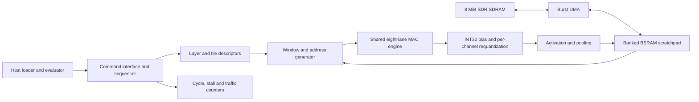

# Ushqyn roadmap: a competitive TinyML FPGA accelerator and research paper

Created 2026-09-08 from source revision `3aa5fe8` and the [project assessment](/Users/sayat/Documents/GitHub/tinyML_accelerator/docs/RESEARCH_ASSESSMENT.md). Planning assumptions confirmed by the user: **one full-time researcher, equal emphasis on audio and vision, Tang Nano 20K as the primary hardware target**.

Plan for **32 working weeks plus up to 8 weeks of contingency**. These are effort estimates, not a promise of publication or SOTA. Week 1 starts when implementation begins; this document creates no scheduled jobs. A milestone is complete when its evidence passes, not when its week ends. The executable task order and definitions of done are in the [implementation backlog](/Users/sayat/Documents/GitHub/tinyML_accelerator/docs/RESEARCH_BACKLOG.md).

The intended outcome is a programmable accelerator that runs keyword spotting and visual wake words on the same Tang Nano 20K bitstream, with an anomaly-detection model as a third evaluation workload. The intended paper contribution is a demonstrably better method for scheduling and allocating quantized inference under physical FPGA memory constraints.

**Implementation record:** see [phase 0–1 status](research/PHASE_0_1_STATUS.md).
The [prior-work decision](research/novelty_matrix.md) selects DeFiNES as B3 and
requires a COSMA placement comparison. Broad joint-scheduling/port-awareness
claims are already covered by prior work; novelty remains provisional.

## 1. Define exactly what “SOTA” means

Use this provisional claim scope:

> Improved measured energy–latency–memory tradeoffs for programmable INT8 TinyML inference on a resource-constrained FPGA, at matched model quality, using a compiler that schedules tensor tiles and their physical BSRAM placement together.

Two claims must be evaluated separately:

1. **Accelerator competitiveness:** an implemented, timing-closed design lies on an improved measured Pareto frontier against the eligible comparable designs. State device, workloads, accuracy, memory allowance, and measurement boundaries. Report what wins and what loses.
2. **Research novelty:** the algorithm or architectural mechanism solves a constraint/tradeoff that the closest prior work does not already solve, and controlled experiments show that mechanism causes the improvement.

A speedup over the currently incorrect baseline does not establish either claim. A new benchmark record on one small FPGA does not automatically make a top-tier paper. Conversely, a useful general architectural result can support a strong paper without winning every metric. Recheck the literature and public implementations immediately before submission; a September 2026 comparison does not establish SOTA months later.

### Proposed scorecard

All numeric performance/improvement values below are **development targets**, not achieved results or conference acceptance thresholds.

| Dimension | Required evidence / initial target |
|---|---|
| Correctness | Zero mismatches against an independent integer specification at the declared accelerator boundary. Separate model-quality evaluation. |
| Audio | Pinned MLPerf Tiny KWS DS-CNN; target at least 90% top-1 under the pinned evaluator. |
| Vision | Pinned MLPerf Tiny VWW MobileNetV1 0.25×; target at least 80% top-1. |
| Third workload | Pinned ToyADMOS autoencoder; target at least 0.85 ROC-AUC with the official scoring/aggregation. |
| Programmability | KWS and VWW run using the same release bitstream, changing model/program descriptors and weights without modifying RTL. Include switching/loading cost separately. |
| Resource fit | All device limits satisfied after routing. Integration target: at most 40 of 46 BSRAM blocks and about 80% of LUT4s; an exception needs a documented implementation result and revised budget. |
| Clock | Establish correct operation at 27 MHz, then target 54 MHz. Explore 81 MHz only after timing and board validation. No result computed from hypothetical Fmax is labeled measured latency. |
| Latency targets | Initially aim for KWS execution ≤20 ms and VWW execution ≤100 ms at the declared operating clock, including required on-board DMA. Reassess after the first complete model inventory and measured roofline. |
| Stability | 10,000 consecutive automated inference jobs, balanced between audio and vision, with no hangs, stale outputs, or integer-output mismatches. |
| Research improvement | Aim for ≥1.3× geometric-mean energy or latency improvement against the strongest matched baseline across both primary workloads, plus a meaningful memory result such as ≥2× lower peak intermediate storage on at least one workload. Report both per-workload values; the mean cannot conceal a lost quality target. |
| Regression guard | At the selected Pareto operating point, aim for no more than 10% degradation of the other performance metric on either primary workload; otherwise publish the tradeoff and reconsider the chosen point. |
| Scheduler quality | On small enumerated problems, validate feasibility and optimum within the defined candidate space. On larger held-out cases, aim for solutions within 10% of the best explored feasible objective and ≤60 s search per model on a specified host. |
| Cost model | On held-out configurations, aim for median cycle error ≤10%, 95th-percentile error ≤20%, and exact memory-budget feasibility. Calibrate energy separately against measurements. |
| Generalization | Run budget sweeps on the Tang Nano and validate on a second FPGA target where hardware access can be arranged. Distinguish measured, post-route-only, and simulated results. |

The board limits and the distinction between BSRAM and 8 MiB of SDR SDRAM come from the [official Sipeed specification](https://wiki.sipeed.com/hardware/en/tang/tang-nano-20k/nano-20k.html). The stated quality thresholds are from [MLPerf Tiny rules](https://github.com/mlcommons/tiny/blob/master/benchmark/MLPerfTiny_Rules.adoc); their applicability must be frozen with the actual model/evaluator release at G0. MLCommons has already published [v1.4 results in July 2026](https://mlcommons.org/2026/07/mlperf-tiny-v1-4-results/), so do not assume the earlier v1.3 label is current.

## 2. Choose and freeze the workloads before expanding the ISA

Audio and vision each receive half of the primary optimization/evaluation attention. The third workload tests generality and must not displace either primary workload when time gets tight.

| Role | Model / input | Required functionality | Board dependency |
|---|---|---|---|
| Bring-up only | Existing MLP and SmallCNN / MNIST | FC, ordinary Conv, ReLU, MaxPool | BSRAM-only design |
| Primary audio | KWS DS-CNN / 49×10 MFCC features, 12 classes | Initial 10×4 convolution with stride 2 and SAME padding; DW3×3; PW1×1; folded BN; ReLU; average pooling; FC; declared final-output handling | Inventory exact model before deciding whether weights fit on chip |
| Primary vision | VWW MobileNetV1 0.25× / 96×96×3 | Conv3×3; DW3×3 stride 1/2; PW1×1; asymmetric SAME padding; folded BN; activation clamp including ReLU6 if present; average pooling; FC; declared final-output handling | Tiled activations and likely SDRAM; shapes/channels exceed current packed fields |
| Secondary | ToyADMOS ToyCar autoencoder / 640 input features | FC, folded BN, ReLU, linear output, reference reconstruction scoring | Roughly 258 KiB of INT8 weights from the reference topology; requires external weight storage |

Primary model sources: [KWS model](https://github.com/mlcommons/tiny/blob/master/benchmark/training/keyword_spotting/keras_model.py), [KWS preprocessing](https://github.com/mlcommons/tiny/blob/master/benchmark/training/keyword_spotting/README.md), [VWW model](https://github.com/mlcommons/tiny/blob/master/benchmark/training/visual_wake_words/vww_model.py), [AD artifacts](https://github.com/mlcommons/tiny/blob/master/benchmark/training/anomaly_detection/trained_models/README.md).

At G0, pin the repository commit, rules/evaluator, trained model files and hashes, preprocessing, dataset manifests, calibration IDs, and tensor layout. Generate a machine-readable inventory of every node, attribute, shape, weight byte count, activation byte count, bias/scale table, and useful MAC count. The inventory is the authority if a source model changes.

Preserve the full output contract. If softmax or AD scoring runs on the host, label the accelerator boundary accordingly, verify the host computation, and include it in application-level latency. Do not silently omit operators to make a model fit or claim full hardware inference while excluding required work. An official MLPerf submission is a separate deliverable that must satisfy the pinned rules; the initial objective is reproducible research evaluation.

Use model conversion to ONNX only through a saved, validated conversion script. Compare converted floating-point outputs against the source framework before introducing quantization. Use separate calibration and test sets. If retraining becomes necessary, freeze the training recipe and report at least three seeds; do not tune on the final test set.

## 3. Freeze a small, reusable hardware architecture

Build one eight-lane INT8 compute engine with INT32 accumulation, a banked synchronous BSRAM scratchpad, a window/address generator, and a pipelined per-channel requantizer. Begin with output-stationary tiles: finish a bounded group of outputs, requantize, and release their partial sums. Reuse the datapath across FC, regular convolution, pointwise convolution, and depthwise convolution.

For ordinary/pointwise convolution, start by broadcasting one activation to eight output-channel lanes and supplying eight weights per cycle. Depthwise mode needs distinct lane activations; explicitly budget its memory ports or time-multiplex access. A dense 3×3 first layer with few output channels will have different utilization from a wide 1×1 layer. Measure both instead of asserting eight useful MACs/cycle everywhere.



Architecture decisions to complete by G2:

- One shared source manifest and decoder for simulation and the board, with only memory/clock/I/O wrappers specific to the target.
- A versioned model image with target/ISA/numerical-contract identifiers; reject a mismatched image.
- Layer/tile descriptors with full dimensions, independent kernel/stride/padding axes, group mode, bases/strides, tensor datatype, and quantization parameters. Use at least 16-bit logical shape fields while validating the actual supported limits.
- Keep 64-bit instruction words if convenient, with descriptor-referencing commands rather than repeatedly enlarging inline geometry. Existing LOAD/STORE ISA addresses are already 24 bits; propagate sufficient width through the downstream RTL and host protocol for the 8-MiB SDRAM.
- Explicit tensor layout conversion once during lowering. Layout belongs in the IR/descriptor contract; no implicit NHWC/NCHW reinterpretation.
- Correct static asymmetric activation zero points and symmetric per-channel weights as the main contract, with INT32 biases in product units. If implementation starts with symmetric activations temporarily, keep that limitation explicit and do not call it support for the pinned quantized artifacts.
- Preserve eight-bit MAC inputs by precomputing `bias_corrected[c] = bias_int32[c] - input_zero_point * sum(weight_int8[c])` over the full reduction dimension. Compute/check this correction in a wider compiler intermediate and prove that stored bias and every hardware partial sum fit the chosen width. Add corrected bias once per completed output, not once per input-channel tile. Feed padding as `qx = input_zero_point`; skipping padded MACs requires a corresponding correction and is not an implicit optimization. This avoids an unacknowledged nine-bit `qx - zero_point` multiplier input.
- Request/response memory handshakes, even before SDRAM, so synchronous memory latency and backpressure are part of the interface.
- A program/metadata region independent of bulk activation/weight storage; no duplicated full “main memory” plus complete tensor copies unless justified by measurement.
- Compile-time accumulation-bound checking, address/capacity validation, and explicit hardware fault/status responses.

Initial 64-KiB payload allocation: 4 KiB program/commands, 16 KiB weight tiles, 16 KiB activation tiles, 16 KiB partial sums, 8 KiB line buffers, and 4 KiB bias/scale/descriptor storage. At 2-KiB payload per block this is 32 blocks; actual port replication and packing must be included in synthesis. Resize regions per model through descriptors within the implemented bank organization.

Do not add a soft CPU, transformer/YOLO support, arbitrary sparsity, or an INT4 datapath to the critical path. Consider 16 lanes or narrower precision only after profiling shows a specific benefit and the fixed-INT8 research claim is established. Preserve the eight-lane version for controlled comparisons.

## 4. The candidate research contribution, and how to test its novelty early

Working title: **Ushqyn: Physical-Memory-Aware Scheduling for Programmable TinyML on Small FPGAs**.

Candidate hypothesis:

> Tensor-byte capacity alone predicts the wrong feasible or efficient schedule when bank ports, BSRAM block rounding, quantization boundaries, and DMA overlap interact. Jointly choosing the tile schedule and physical placement reduces this mismatch and improves complete-model execution on a shared engine.

This is a hypothesis to establish, not a novelty claim already proven. [Fused-Layer CNN Accelerators](https://www.petermilder.com/assets/pdf/papers/16micro.pdf), [SAMO](https://arxiv.org/abs/2112.00170), [DNNExplorer](https://arxiv.org/abs/2008.12745), and [msf-CNN](https://arxiv.org/abs/2505.11483) already cover substantial parts of fusion, architecture exploration, and memory-aware inference. A list of those techniques combined together is not enough.

During weeks 1–2, read the full closest papers and their implementation descriptions. Create a comparison matrix covering compute reuse, physical banks/ports, allocation granularity, live partial sums, fixed quantization semantics, fusion, recomputation, spill/overlap, target sizes, and available code. Mark unknowns as unknown; absence from an abstract is not evidence of absence. Identify the single closest method and commit to reproducing its applicable policy as B3 below.

By week 8, obtain a small analytical/microbenchmark counterexample where the closest separable or byte-capacity-based policy selects a worse or infeasible schedule, and the proposed state model explains why. Validate the counterexample against real memory-port behavior. If no such case exists, stop calling the joint planner novel and choose a narrower problem before writing a large optimizer.

### Proposed optimizer to implement

1. Lower the **fixed quantized graph** to a typed IR carrying scales, zero points, accumulator ranges, shape/stride, and producer/consumer relationships.
2. Enumerate a bounded catalog of legal tile shapes and schedules: layer-at-a-time, Conv→activation→pool, and depthwise→activation→pointwise tiles. Preserve each original quantization/rounding operation inside a fused schedule.
3. For each candidate, compute input halos, intermediate lifetimes, INT32 partial sums, metadata, physical block rounding, read/write port demand, weight reloads, and DMA bursts.
4. Represent a scheduling state by the graph frontier, live tensor slices, assigned banks, and outstanding data transfers. A transition completes a legal tile/fused segment and releases dead storage. Every transition includes all required data movement.
5. Use exact enumeration or dynamic programming on small sequential graphs to establish the optimum **within this catalog**. Keep state needed for future feasibility; do not prune two states merely because one currently uses fewer bytes.
6. Use a bounded beam/Pareto search on larger graphs, with a configurable time budget. Prune only with valid lower bounds or compatible-state dominance. Do not claim a global optimum beyond the explored space.
7. Fit latency/energy terms from measured kernels and DMA traces. Treat resource feasibility as a hard condition. Report cost-model errors on configurations and model layers withheld from fitting.
8. Emit descriptors plus a verifiable allocation/schedule certificate: intervals, live ranges, bank assignment, access demand, transfers, and expected operation counts. An independent checker rejects unsafe output.

The first version schedules sequential graphs because the primary DS-CNN/MobileNet families support a focused study. Residual Add and general DAG scheduling are an extension only if the novelty analysis or third workload requires them. Avoid claiming unrestricted ONNX/DAG support.

### Keep numerical changes separate from scheduling

The main comparison keeps the quantized model fixed and seeks exact output preservation. Switching static versus dynamic activation scaling changes the model's numerical behavior; it is a separate accuracy–performance experiment with separate manifests.

The earlier proposed dynamic-quantization/pooling optimization remains a **secondary experiment**, not the central paper dependency. Track the global max-absolute value over every original biased output, store only pooled INT32 maxima, then requantize once the original scale is known. Preserve discarded-border and negative-value contributions to the scale. The first SmallCNN accumulator tensor would shrink from 10,816 to 2,704 bytes before support-storage overhead, but that is an analytical tensor-size result. Measure actual block savings and any extra weight reads. [TensorRT documentation](https://docs.nvidia.com/deeplearning/tensorrt/11.2.1/inference-library/quantized-types-explicit-quantization.html) already describes quantization propagation/commutation, so this identity alone cannot be the claimed novelty.

Stop this secondary experiment if correctly scaled dynamic quantization offers no useful accuracy/calibration advantage or if the buffering/bandwidth cost loses to static streaming. Do not preserve the current incorrect bias arithmetic for a favorable baseline.

## 5. The 32-week execution plan

Treat the dependency chain as mandatory. Literature, profiling, and artifact work continue throughout; the table identifies the main engineering focus. Until week 20, allocate roughly 28 hours/week to implementation, 8 to research/measurement, and 4 to review/documentation. During the optimizer/evaluation phases, move the implementation allocation into experiment work.

| Phase | Weeks | Deliverable | Exit gate |
|---|---:|---|---|
| P0 | 1–2 | Claim scope, closest-prior-work matrix, pinned audio/vision/AD artifacts, baseline provenance, instrumentation plan | G0: benchmark/claim contract frozen and all current evidence labeled correctly |
| P1 | 3–5 | Correct quantization, canonicalization and fail-fast compiler; independent reference; strict software regressions | G1: confirmed software semantic bugs fixed; source/ONNX parity; full quantized-graph reference quality meets the primary targets. Instruction emission is validated for the supported subset; corrected RTL checks become mandatory after P2 implements the arithmetic. |
| P2 | 6–8 | Explicit target/config, shared source tree and decoder, descriptor contract, repeat-run protocol and profiling | G2: corrected MLP repeats automatically on board; same board hierarchy tested; initial novelty counterexample assessed |
| P3 | 9–12 | Banked scratchpad, shared FC/Conv engine, synchronous window access, static requantization, SmallCNN board build | G3: SmallCNN fits/routs, exact complete-set board comparison and repeat-run test; measured memory/compute profile |
| P4 | 13–17 | Audio/vision operator completion; SDRAM controller and burst DMA; microbenchmark library | G4: rectangular Conv/DW/PW/average pool/activation kernels exact; full SDRAM range and stalled DMA validated |
| P5 | 18–20 | KWS and VWW on the same bitstream; AD integration; strong baseline measurements | G5: both primary models meet quality, exactness, resource/timing, and repeatability gates; meaningful B1/B2/B3 comparisons ready |
| P6 | 21–25 | Joint scheduler, checker, measured cost model, ablations; optional dynamic-pooling experiment | G6: at least one explained advantage over B3, no feasibility errors, held-out cost-model and search-quality results |
| P7 | 26–29 | Full accuracy/energy/latency evaluation, memory sweeps, robustness, second-target validation, independent reproduction | G7: all paper claims trace to frozen artifacts and credible comparisons; go/no-go on SOTA wording |
| P8 | 30–32 | Paper, figures, related-work update, artifact package and external review | G8: reproducible submission package and a defensible final contribution |

Use the contingency weeks for failures discovered at gates, hardware access, timing closure, instrumentation, or research pivots. If the first three hardware phases take their upper estimated effort, move later dates rather than reducing correctness or baseline quality.

### Gates that can change the plan

- **G0 novelty risk:** if the closest work already solves the proposed physical-memory scheduling problem, narrow the hypothesis before building the optimizer. Candidate pivots are compiler-verified memory placement with measured port-conflict bounds, or a demonstrated numerical/storage tradeoff absent from prior work. Each pivot needs its own literature check.
- **G1 quality failure:** fix conversion/quantization first. Permit at most two focused weeks for calibration or QAT investigation before revising model scope transparently. Never compensate for semantic errors by lowering quality targets.
- **G3 hardware over-budget:** reduce live storage, bank duplication, and control cost before increasing device size. Preserve the Tang Nano 20K objective. If 54 MHz is not feasible, publish the timing-closed clock and re-evaluate latency targets.
- **G5 primary workload failure:** keep audio and vision equally required. A fast MNIST/KWS-only result does not satisfy the agreed scope. Inspect missing operators, weights/activation placement, and bandwidth before changing the models.
- **G6 weak research result:** after two bounded optimizer iterations, if the measured improvement over the best matched policy remains below roughly 10% with no capacity or explanatory result, pause the SOTA claim and pivot. Do not add unrelated features to disguise an incremental result.
- **G7 no power instrumentation:** an energy-efficiency claim remains incomplete. Borrow equipment or narrow the claim to the metrics actually measured; do not substitute estimated power for measured energy.

## 6. Fair baselines and the experiment matrix

| ID | Baseline | Role |
|---|---|---|
| B0 | Corrected version of the existing architecture | Historical progress; never the sole baseline |
| B1 | Tuned static-INT8 tiled shared engine, double buffering, immediate requantization, sensible conventional layout | Strong engineering baseline |
| B2 | B1 plus physical liveness-based memory reuse, with scheduling/placement optimized separately | Tests whether the proposed joint optimization adds value beyond ordinary allocation |
| B3 | Closest applicable published schedule/allocation policy, adapted to the same engine and candidate space where legitimate | Research baseline; freeze the choice at G0 and document adaptations/limitations |
| B4 | Complete proposed scheduler and architecture support | Candidate result |

For B1–B4, hold model weights, quantization, lane count, clock, usable bank budget, SDRAM configuration, preprocessing, and inference boundary fixed. Give baselines a recorded tuning budget and verify they are not disabled by artificial constraints. If B3 inherently requires a different architecture, report that original architecture separately and label the adapted-policy experiment honestly. Do not claim an adapted implementation represents every benefit of the original framework.

Also inspect [FINN-R](https://arxiv.org/abs/1809.04570), [FPGA-ML for MLPerf Tiny](https://arxiv.org/abs/2206.11791), [CFU Playground](https://arxiv.org/abs/2201.01863), and public same-board designs such as [MicroCNN-TangNano20k](https://github.com/SweiryDev/MicroCNN-TangNano20k). Reproduce a public design where a matched workload is practical; otherwise place its author-reported results in a clearly labeled context table. Do not imply FINN/hls4ml directly supports Gowin without a working implementation.

Minimum planned measurement matrix:

- Primary: 2 workloads × B1/B2/B3/B4 × 4 bank budgets = 32 configurations at one common timing-closed clock.
- Secondary: AD × B1/B2/B3/B4 × 4 bank budgets = 16 configurations, after external-memory integration.
- Bank budgets: 16/24/32/40 total BSRAM blocks, counting reserved program/control buffers. Mark physically impossible budgets as such; do not silently omit them. If profiling uses a software cap inside a larger physical design, label it an effective-capacity study. Physical area/energy claims require actual corresponding builds.
- Frequency: repeat the main feasible configurations at each design's independently validated operating frequency, separate from the common-clock result.
- Ablations: remove physical-bank cost, joint placement, cross-layer fusion, and DMA-overlap/recomputation choices one at a time. Keep quantization unchanged in these ablations.
- Robustness: include small/odd-channel and spatial-tail kernels, bandwidth throttling, and unseen shape configurations. Include at least one additional width/depth variant in each primary model family if claiming broad family-level performance; publish its separate quality result.
- Hardware implementation: use multiple place-and-route seeds where the tool supports controlled seeds; otherwise record deterministic tool settings and repeatability. A second-target experiment is scheduled by G7, with its evidence level declared.

Do not use the interpreted Python golden model as the performance baseline. An optimized MCU comparison is useful context if hardware is available, but cross-platform voltage, process, host work, and accuracy must be stated.

## 7. Measurement and evidence protocol

### Correctness and quality

Maintain four distinct comparisons: source framework versus converted float graph; float versus quantized model quality; independent integer oracle versus instruction simulator/RTL; integer oracle versus board outputs. The oracle must not call the compiler's lowering/execution implementation for arithmetic decisions.

G1 establishes software correctness and full-model quality through an architecture-independent quantized-graph evaluator. It does not require emitting hardware instructions for depthwise/average-pool nodes before their lowering/RTL exists. Those graphs must fail hardware compilation explicitly until support lands. Restore strict RTL checks during P1/P2, record any known migration failures, and require them to pass for the corrected board MLP at G2, SmallCNN at G3, and the complete primary models at G5. Never substitute a permanently forced-pass flag for a pending implementation.

Use the full pinned accuracy sets. Publish the exact sample counts and hashes; where the official accuracy set is a subset, also evaluate the original held-out set for the paper and label the two separately. Reuse the same calibration/test partition across methods with fixed arithmetic. Test every known assessment failure and the new model's actual boundary shapes. Integer mismatches and classification errors are different events.

### Performance

Record actual cycle counts and clocks, including setup, DMA, partial-sum spills, and final writes. Define counters so overlapping compute/DMA events are not incorrectly added into total cycles. Measure at least 1,000 timed inferences per feasible configuration after documented warm-up, unless the official protocol requires a different count. Report distributions where execution/input dependence exists, and fixed cycles where it does not.

Use three boundaries: accelerator execution with required device-side transfers; complete host-to-board application execution with required preprocessing/postprocessing; one-time model loading/switching. Do not remove DDR/SDRAM transfer costs from the first boundary when the model needs them. UART throughput is an application constraint, not the MAC engine's compute throughput.

### Energy

Arrange suitable calibrated voltage/current measurement access during P0. The primary boundary is the complete Tang Nano board input supply, including FPGA, SDRAM and regulators. Document whether the debugger is included and prevent an unmeasured secondary USB supply path. Use a GPIO marker and integrate `E = integral(V(t) * I(t) dt)`. Report gross joules per inference; idle-subtracted energy is secondary and clearly labeled.

Use at least five independent measurement sessions with randomized configuration order. Choose windows of at least 10 seconds or enough repeated inference to suit the instrument resolution. Save sample rate, calibration/offset, voltage, warm-up, ambient conditions, raw traces, mean and 95% confidence intervals. Account for repeated-session rather than only within-batch variation. Follow the pinned [official runner/tutorial](https://github.com/mlcommons/tiny/blob/master/benchmark/TUTORIAL.md) if making official benchmark claims; custom measurements stay labeled research measurements.

### Reproducibility

Every result requires a manifest containing source commit and dirty diff, target/device/board revision, compiler and FPGA-tool/IP versions, generated target parameters, model/dataset/calibration/program/bitstream hashes, clock/SDRAM settings, resource/timing reports, evaluator version, host/instrument details, scripts, and raw output paths. Missing values remain unavailable, not zero.

Add these command interfaces during implementation; **they do not exist merely because they are listed here**:

```
make verify TARGET=tang20k
make simulate-board TARGET=tang20k MODEL=<pinned-model>
make fpga-build TARGET=tang20k CLOCK_MHZ=<validated-clock>
make board-regression TARGET=tang20k MODEL=<pinned-model>
make benchmark CONFIG=<frozen-experiment-manifest>
make paper-figures RESULTS=<frozen-results-directory>
```

A clean checkout must regenerate each reported figure from raw results. Archive model licenses and generation instructions, publish redistributable artifacts, and document proprietary tool/IP dependencies. [FCCM's artifact process](https://www.fccm.org/artifact-evaluation-2026/) illustrates the expectation of reusable source, hardware, and data; check the actual submission year's instructions before release.

## 8. Paper deliverables and submission decision

Start a two-page argument by week 8: problem, closest prior work, candidate mechanism, predicted tradeoff, and decisive experiment. Update it after every gate. The final manuscript should have these evidence-backed components:

1. A motivating measured failure of byte-only/separate scheduling and placement under small physical memory budgets.
2. The precise state/cost model, legality conditions, search algorithm, and its limitations.
3. A shared programmable hardware implementation and its BSRAM/dataflow interfaces.
4. Same-device comparisons against B1–B3 with fixed arithmetic and honest tuning effort.
5. Audio, vision, and third-workload quality/latency/energy/resource results.
6. Ablations, sensitivity, cost-model errors, search time, unfavorable cases, and generalization.
7. An artifact package with a clean-room reproduction attempt by another person.

Plan eight main figures/tables: resource bottleneck and memory fragmentation; architecture; legal schedule example; latency/energy Pareto plots; memory/traffic comparison; ablations; held-out cost-model/search validation; complete resource/quality/provenance summary.

Target a strong FPGA venue such as ACM FPGA or FCCM if the main result is this compiler/architecture combination. Consider a broader architecture venue only if the demonstrated principle and evaluation extend beyond the one platform. Choose the actual submission cycle after G5; do not compress failed gates to meet an unverified deadline. Refresh the novelty matrix and comparison set before submission.

The first implementation task is **Q01 in the backlog: write the executable numerical contract and preserve the known failing examples as regressions**. The first hardware research milestone is **G3: a correct, reproducible SmallCNN on the Tang Nano 20K**. The SOTA decision is **G7**, after competitive measurements exist.
